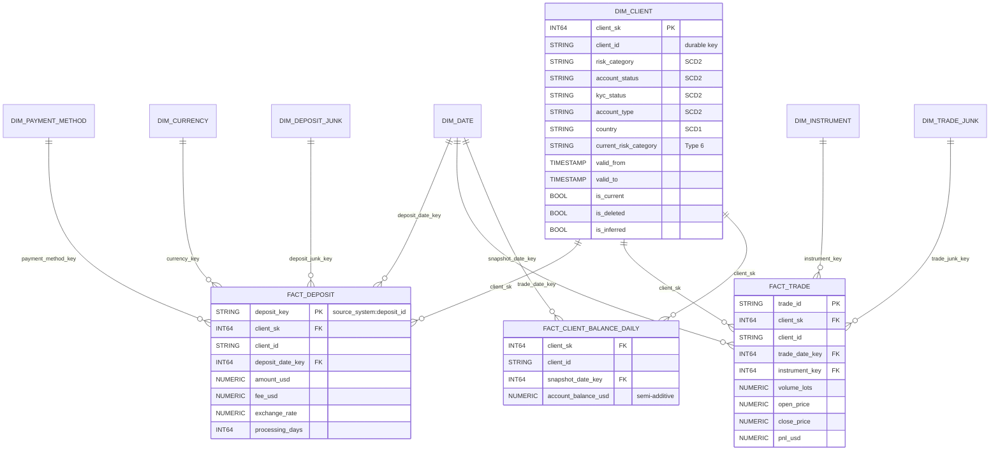

# PLAN - Deriv Trading Data Pipeline (Medallion on GCS + BigLake + BigQuery + Dataform)

Work one step at a time. Check a step off when done and log decisions / changed assumptions below.

## Steps

- [x] 1. `PLAN.md` - step checklist and decision log
- [x] 2. `docs/design.md` - Part 1a design document (architecture, idempotency, late/missing data, source deletes, edge cases)
- [x] 3. `infra/setup.md` + `scripts/` - bucket layout, versioning/retention, BigLake connection, datasets, sample-data upload (commands documented, not executed)
- [x] 4. Dataform bronze - raw-line BigLake tables (vendor, CDC, seeds), object table, `audit.file_manifest`
- [x] 5. Silver staging - vendor header mapping + field-count check, CDC parsing + lsn ordering, seed parsing, typing, dedup, DQ severity
- [x] 6. Silver core - `client_signup`, `client_trades`, `client_profile` (+ SCD2 history, `client_profile_active` view), `vendor_deposit`
- [x] 7. Recon - `client_deposit` (+ `client_deposit_apply`), `stg_deposit_match`, `recon.deposit_match`, `recon.deposit_conflicts`, `recon.deposit_reconciliation`
- [ ] 8. Quality and ops (partially done - see "Remaining plan" below)
  - [x] 8.1 `quarantine.rejected_records` - MERGE insert-only of every staging view's REJECTED rows (`definitions/quality/rejected_records.sqlx`)
  - [ ] 8.2 `audit.dq_issues`
  - [ ] 8.3 `audit.expected_files`
  - [ ] 8.4 `audit.run_log`
  - [ ] 8.5 `erase_deleted_client_pii`
  - [ ] 8.6 Assertions
  - [ ] 8.7 Unit tests
- [ ] 9. Validate - `dataform compile`, BigQuery dry runs, upload sample data, run with `AS_OF_DATE=2024-03-05`, check expected outcomes
- [ ] 10. Part 2 - Gold dimensional model (Kimball star) and historization: `docs/data_model.md` + `dataform/definitions/gold/*` (placeholders created; see "Part 2 plan")
- [x] 11. Part 3 - TL extension: `docs/part3.md` (real-time + batch, build vs buy). Design only; no new services stood up.

- [x] 11. Part 3 - TL extension: `docs/tl_extension.md` (3a unified real-time + batch architecture, 3b build vs buy)

## Part 3 summary (see `docs/tl_extension.md`)
- **3a:** Pub/Sub event log (schema registry, `event_id`) with two independent consumers:
  - Dataflow streaming + Bigtable features + Vertex AI/rules for fraud signals, p99 under 2 s;
  - the existing GCS/BigQuery/Dataform medallion for batch.

  Isolation comes from separate subscriptions and separate BigQuery reservations. Eventual consistency is accepted for detection and dashboards, never for the weekly report or reconciliation (closed-period cutoff, restatements). The partner API goes through Apigee on authorized views, uses write-audit-publish snapshots, and is protected by row-level security, masking and VPC Service Controls.
- **3b:** Build a thin connector on the existing framework: a webhook receiver to Pub/Sub for fraud, and settlement files to GCS landing for reconciliation. Payments are core, real-time and PCI-adjacent. Use Fivetran/RudderStack for long-tail SaaS sources. Switch to buying if a certified near-real-time, PCI-compliant connector exists, if volume is low, or if the deadline and team capacity make building unrealistic.

## Part 2 plan - Data model and historization (gold layer)

### 2a. Approach: Kimball star schema on top of silver

**Why Kimball, not Data Vault:**
- There are only 3 sources (warehouse tables, the vendor CSVs, the CDC log), with stable business keys (`client_id`, `deposit_id`, `trade_id`).
- The consumers are analytics and regulatory reporting: PnL, deposits, risk exposure by client segment.
- A star gives the simplest, fastest queries on BigQuery.
- Data Vault's strengths (many sources, auditable raw integration, parallel loading) are already covered by our layers:
  - bronze is immutable and replayable;
  - silver keeps the SCD2 history (`client_profile_history`), lineage columns and `recon.deposit_conflicts`.

  A vault would add hubs, links and satellites, plus a second modelling layer, with no new capability.
- **Silver is the integration layer, gold is the star.** If sources multiply later, a vault can be inserted between the two without changing gold.

**Dataset:** `gold`. Surrogate keys are deterministic: `FARM_FINGERPRINT(durable_key || version)`. Reloads therefore reproduce the same keys, and facts never need re-keying. Facts also carry the durable `client_id` (a hybrid key), which allows "as it is now" reporting without a join through history.

**Facts (grain):**

| Fact | Grain | Measures | Notes |
|---|---|---|---|
| `fact_deposit` | One row per deposit (`source_system`, `deposit_id`) | `amount_usd`, `fee_usd`, `exchange_rate`, `processing_days` | Transaction fact, partitioned by `deposit_date`, clustered by `client_id`. `recon_status` and `source_system` go through the junk dimension |
| `fact_trade` | One row per trade (`trade_id`) | `volume_lots`, `open_price`, `close_price`, `pnl_usd` | Transaction fact, partitioned by `trade_date` |
| `fact_client_balance_daily` | One row per client per calendar day | `account_balance_usd` (semi-additive: sum across clients, never across days) | Periodic snapshot built from `client_profile_history` as of end of day (UTC) |
| `fact_deposit_reconciliation_daily` (optional) | One row per recon key per `as_of_date` | count / amount by `recon_status` | Periodic snapshot of `recon.deposit_reconciliation`, for trending breaks over time |

**Dimensions:**
- `dim_client`: SCD2. It merges `client_signup` and `client_profile_history`. PII columns get policy tags.
- `dim_date`: a generated calendar.
- `dim_instrument`: instrument and asset class (FX, metal, crypto, index).
- `dim_payment_method` and `dim_currency`: SCD1.
- `dim_deposit_junk`: every combination of status, source system and recon status.
- `dim_trade_junk`: direction and trade status.

Each dimension has a `-1` "Unknown" member.

**Late-arriving dimension records (inferred members):**
1. When a fact's `client_id` has no row in `dim_client`, an **inferred member** is inserted: `is_inferred = TRUE`, attributes set to 'Unknown', `valid_from = 1900-01-01`. The fact joins to it straight away, so no fact is dropped or held back.
2. When the real client row arrives, the inferred row is **updated in place** (type 1 fill), keeping the same `client_sk`. Later changes create normal SCD2 versions. Facts need no re-keying.
3. **As-of lookup:** a fact's `client_sk` is the version where `valid_from <= event_ts < valid_to`. An event dated before the client's first version falls back to the earliest version and is flagged `dim_lookup_fallback`. This matters here: 20 of the 24 vendor deposits are dated before `signup_date`.
4. Silver already holds unknown-client vendor rows during the grace window (ORPHAN_PENDING). Gold therefore mainly sees late *profile* versions, and inferred members cover the rest.

### 2b. Historization (SCD)

**1. SCD type per attribute:**

| Attribute | Type | Why |
|---|---|---|
| `risk_category`, `account_status` (also `kyc_status`, `account_type`) | **SCD2** in `dim_client` | Regulators ask what the client's risk category was when the trade happened. PnL and exposure must be reportable by the historical segment |
| `current_risk_category`, `current_account_status` | **Type 6** columns (type 1 overwrite on every version) | Lets you report history grouped by the *current* segment without a self-join |
| `account_balance_usd` | **Not a dimension attribute.** Modelled as `fact_client_balance_daily` (periodic snapshot), with full CDC detail kept in `silver.client_profile_history` | The balance is a volatile measure. SCD2 on it would create a new client version on every deposit or trade, exploding `dim_client` and breaking dimension semantics |
| `full_name`, `email`, `country` | SCD1 | Corrections, not business changes. Also subject to PII erasure |

- **Trade-offs:** SCD2 means more rows, joins on date ranges, and care with surrogate keys. In exchange you get correct point-in-time analytics and an audit trail.
- **Mitigations:** clustering on `client_id`, `is_current`, the Type 6 columns, and a `dim_client_current` view.

**2. Update and delete handling:** the logic already exists in silver (`stg_client_profile_versions`) and gold reuses it.
1. Events are ordered by `lsn`, not by `commit_ts` or file order. A version is applied only if its `lsn > last_applied_lsn`.
2. **Update:** partial image with key-presence semantics. The new full state is compared with the current `dim_client` row on the SCD2 columns.
   - If an SCD2 column changed: close the current row (`valid_to = commit_ts`, `is_current = FALSE`), insert a new version, and refresh the Type 6 columns on every version of that client.
   - If only the balance changed: no new dimension version. It goes to the balance fact.
   - Both steps run in one MERGE per client batch.
3. **Delete** (e.g. CL012 at lsn 1010):
   - Close the current version and insert a final version with `is_deleted = TRUE`, `deleted_at = commit_ts`, keeping the last known attributes.
   - Facts (DEP008, VDEP004) keep pointing at valid versions, so referential integrity holds.
   - `dim_client_current` excludes deleted clients. The balance snapshot stops after `deleted_at`.
   - A later re-insert opens a new version.
   - After the retention period, `erase_deleted_client_pii` nulls PII on every version.

**3. Reloading a historical range (e.g. November 2024) without corrupting history:**
1. **Scope by client, not only by date.** Select the clients with events whose `commit_ts` falls in the range. Recompute each one's **full** version chain from the snapshot plus all their events: partial images mean a November version depends on October state, and December versions depend on November.
2. **Deterministic keys:** `client_sk = FARM_FINGERPRINT(client_id || version_lsn)` and the history key is (`client_id`, `version_lsn`). Reprocessing the same bronze files yields the same rows, so a MERGE never creates duplicates.
3. **Atomic replace** in one transaction: delete those clients' versions and insert the recomputed chain. This also removes versions that no longer exist, for example after a corrected CDC file. Other clients are untouched.
4. **Facts:** partition overwrite. For `fact_deposit` and `fact_trade`, rebuild the November `deposit_date` / `trade_date` partitions, re-looking up `client_sk`. For `fact_client_balance_daily`, rebuild from the start of November until the next balance change of each affected client, because the balance carries forward.
5. **Safety:**
   - Take a BigQuery table snapshot (or rely on time travel) before the reload.
   - Parameterize with Dataform vars `reprocess_from` / `reprocess_to`.
   - Dry-run and set `maximum_bytes_billed`.
   - Compare row counts and assertions before and after: one current version per client, no overlapping `valid_from` / `valid_to`.
   - Bronze is immutable and CDC is `lsn`-guarded, so the reload is repeatable.

### Part 2 files (placeholders, to implement)
- `docs/data_model.md` - Part 2a/2b write-up (from this section).
- `dataform/definitions/gold/dim_date.sqlx`, `dim_client.sqlx`, `dim_instrument.sqlx`, `dim_payment_method.sqlx`, `dim_currency.sqlx`, `dim_deposit_junk.sqlx`, `dim_trade_junk.sqlx`
- `dataform/definitions/gold/fact_deposit.sqlx`, `fact_trade.sqlx`, `fact_client_balance_daily.sqlx`, `fact_deposit_reconciliation_daily.sqlx`
- `dataform/definitions/gold/dim_client_current.sqlx` (view)
- `dataform/definitions/gold/reprocess_client_history.sqlx` (range reload operation)

## Remaining plan

Code written so far has **not been compiled or run** (agreed, due to time). Step 9 must happen before any claim that it works.

### 8.2 `audit.dq_issues` (`definitions/quality/dq_issues.sqlx`, operations, hasOutput)
- `CREATE TABLE IF NOT EXISTS` (issue_id, entity, record_key, source_uri, rule_code, severity = 'WARN', first_seen_at), partitioned by `DATE(first_seen_at)`, clustered by `entity, rule_code`.
- MERGE insert-only on `issue_id = SHA256(entity | record_key | rule_code | source_uri)` from:
  - `UNNEST(SPLIT(warn_codes, ','))` of every view in `cfg.STAGING_SOURCES` (non-REJECTED rows);
  - `stg_client_profile_versions.warn_codes` with `record_key = client_id:version_lsn` (CDC drift, insert-on-existing, change-without-insert, implausible DOB).

### 8.3 `audit.expected_files` (`definitions/audit/expected_files.sqlx`, table)
- Calendar `GENERATE_DATE_ARRAY(vendor_feed_start_date, as_of_date)` left-joined to `file_manifest` (feed = 'vendor') on `business_date`.
- Status: `RECEIVED`; `LATE` if `arrival_date > business_date + vendor_sla_days`; `PENDING` if not received and not yet due; `MISSING` if not received and `business_date + vendor_sla_days < as_of_date`.
- Expected on the sample (as of 2024-03-05): 0301 and 0302 RECEIVED, 0303 LATE, 0304 PENDING.

### 8.4 `audit.run_log` (`definitions/audit/run_log.sqlx`, operations)
- `CREATE TABLE IF NOT EXISTS`, then an intentional append of one row per entity per run: run_ts, as_of_date, entity, rows_read, rows_rejected, rows_orphan_pending, rows_warned, rows_valid (COUNTIFs over each `cfg.STAGING_SOURCES` view), plus raw line counts from `stg_vendor_lines` / `stg_cdc_lines`.
- Depends on `client_deposit_apply`, `rejected_records`, `dq_issues` so it runs last.

### 8.5 `erase_deleted_client_pii` (`definitions/quality/erase_deleted_client_pii.sqlx`, operations, tag `gdpr_erasure`, not in the default schedule)
- For clients with `is_deleted` and `deleted_at < as_of_date - pii_retention_days`: NULL `full_name`, `date_of_birth` in `client_profile` and `client_profile_history`, and `email` in `client_signup`. Keys and financial facts are kept.

### 8.6 Assertions (`definitions/assertions/`)
- Built-in `uniqueKey` / `nonNull` already on the incremental tables (`client_signup`, `client_trades`, `vendor_deposit`, `client_profile_history`, `file_manifest`).
- To add: `client_deposit` unique on (`source_system`, `deposit_id`); `client_profile` unique on `client_id`; exactly one `is_current` version per client in history; FK `client_deposit.client_id` / `client_trades.client_id` in `client_signup`; seed parse parity (no `stg_seed_*_json` row starting with `{` has `j IS NULL`); no `MISSING` rows in `audit.expected_files` (SLA alert).

### 8.7 Unit tests (`definitions/tests/`, Dataform `type: "test"`)
- `stg_vendor_deposit`: `method` header maps to `payment_method`; negative amount -> REJECTED `NON_POSITIVE_AMOUNT`; unknown client inside grace -> ORPHAN_PENDING.
- `stg_client_profile_versions`: CL014 events given out of order (1009 before 1008) -> current `risk_category = medium`, balance 12300; partial image keeps untouched columns; delete -> `is_deleted`.
- `stg_deposit_match`: exact match NOOP, composite match LINK, client mismatch BLOCKED, two candidates -> BLOCKED_AMBIGUOUS_MATCH, no candidate -> INSERT.

### 9. Validation
1. `./scripts/dataform.sh compile` and fix compile errors.
2. BigQuery dry run of each compiled query (`maximum_bytes_billed` set).
3. After approval: run `infra/setup.md`, `scripts/upload_sample_data.sh`, then `AS_OF_DATE=2024-03-05 ./scripts/dataform.sh run` and `test`.
4. Expected outcomes to check: VDEP001 and DEP012 quarantined; VDEP020 ORPHAN_PENDING (CL099, arrived 2024-03-05) and DEP020 quarantined (CL031); 0303 rows loaded despite back-dating; VDEP002/VDEP005 no-op on redelivery; CL014 ends `medium`; CL012 soft-deleted; vendor rows inserted with `source_system = 'VENDOR'` (no id overlap with DEP*).

## Agreed decisions

| # | Decision |
|---|---|
| D1 | Medallion: GCS (immutable files) -> Bronze (BigLake) -> Silver (Dataform staging views + core tables) -> Gold (deferred). Quality/ops live in separate datasets: `quarantine`, `recon`, `audit`. |
| D2 | GCS stores files only (object versioning + retention). Every transformation, validation, CDC apply and reconciliation runs in BigQuery via Dataform. |
| D3 | Orchestration: Dataform workflow configurations (scheduled). SLA and DQ checks are Dataform assertions. No Cloud Run / Workflows / Composer. |
| D4 | Bronze tables are one-STRING-column raw-line BigLake tables (CSV format with an unused delimiter, quoting disabled, no header skip). Header mapping and JSON parsing happen in SQL, so schema drift can never silently shift columns. |
| D5 | A BigLake object table lists every landed object; `audit.file_manifest` records (uri, generation, md5, size). A re-delivered file with the same name gets a new generation and is detected as a restatement. |
| D6 | Vendor CSV: header-name alias map (`method` -> `payment_method`), rows whose field count differs from the header are quarantined, files missing a required column are quarantined whole. |
| D7 | Seeds (4 JSON arrays) read via the same raw-line pattern: drop `[`/`]`, strip trailing comma, `SAFE.PARSE_JSON`, parity assertion (object-like lines = parsed rows). |
| D8 | Idempotency: file manifest + MERGE on business keys + `row_hash` no-op skip; CDC versions applied only when `lsn > last_applied_lsn`; logs keyed by deterministic ids and MERGEd insert-only. |
| D9 | Vendor has priority on `client_deposit`: two-pass match (exact id / previously linked vendor id, then client + currency + amount +/-0.5% (min $0.01) + date +/-3 days). Merge key (`source_system`, `deposit_id`). Operational diffs overwrite, unmatched vendor rows insert, client/amount/currency mismatch or ambiguous -> BLOCKED in `recon.deposit_conflicts`. Precedence by vendor file business date. |
| D10 | Late/missing: bronze is partitioned by **arrival** date, so a back-dated late file always falls in the recent arrival window (7-day lookback). Recon recomputes affected business dates; states self-heal (PENDING -> MATCHED / MISSING_IN_VENDOR after 3-day grace). Orphans retried until grace, then quarantined. |
| D11 | CDC: snapshot is version 0 at baseline lsn 1000; versions folded in lsn order with key-presence semantics (absent key = unchanged, explicit null = set null); before-image drift check; insert on existing key = upsert; soft delete + SCD2 history; PII erasure op for deleted clients after retention. |
| D12 | DQ severity: ERROR -> `quarantine.rejected_records` (never loaded); WARN -> loaded with `dq_flags` and logged to `audit.dq_issues`. |
| D13 | Environment config (project, location, bucket, connection) comes from environment variables passed to the Dataform CLI by `scripts/dataform.sh`; `workflow_settings.yaml` only has placeholders. |
| D14 | `as_of_date` var drives grace/lookback/SLA logic (defaults to `CURRENT_DATE()`); set it explicitly to replay history (sample data uses `2024-03-05`). |
| D15 | Real-time fraud is a separate path: payments outbox → Pub/Sub → Dataflow → `fraud.signals` + `realtime` dataset. It never writes silver or gold. Dataform stays the only writer of the book of record and the weekly report reads gold only. D3 still applies to the batch graph. |
| D16 | A new payment processor is onboarded by building a thin lander into GCS (raw prefix + header map + existing DQ/recon), not Fivetran or RudderStack. Buy Fivetran extract-only only if several non-file sources show up or legal accepts a certified connector. |

## Decision log / changed assumptions

- (step 1) Plan layout confirmed: datasets `bronze`, `silver_staging`, `silver`, `quarantine`, `recon`, `audit`, `dataform_assertions`.
- (step 5) BigLake external tables have no line-number pseudo-column: within-file tie-breaks use content hashes, and exact duplicate lines in one file collapse (`line_copies`, WARN `DUPLICATE_LINE_IN_FILE`).
- (step 5) A field-count mismatch quarantines only that row; a missing required column quarantines the whole file.
- (step 5) The CDC lines view is not limited to the arrival window, because partial update images need the full event history for the fold. At scale, fold from the current history version instead of the snapshot.
- (step 6) `client_profile` is derived from the current version in `stg_client_profile_versions` (a single fold feeds both the history and the current state). The snapshot version uses `valid_from = 1900-01-01` as "beginning of time".
- (step 7) The vendor match view reads `client_deposit` live. To avoid a graph cycle, the table is created and seeded by the `client_deposit` operation and vendor changes are applied by the separate `client_deposit_apply` operation (one transaction, rolled back and re-raised on error).
- (step 7) The composite-equal first match is a `LINK` action: it only records `vendor_deposit_id`, and later runs match exactly on that link.
- (step 8) The user asked to stop building after 8.1; the rest is recorded above as the remaining plan. Nothing has been compiled or run.
- (step 11) Part 3 is design-only in `docs/part3.md`. The seconds-level fraud SLO needs an event at commit time; the daily CSV cannot provide it. Stream output is advisory and can be retracted after batch recon. Partner reads a swapped gold snapshot, with fraud status labelled provisional.
