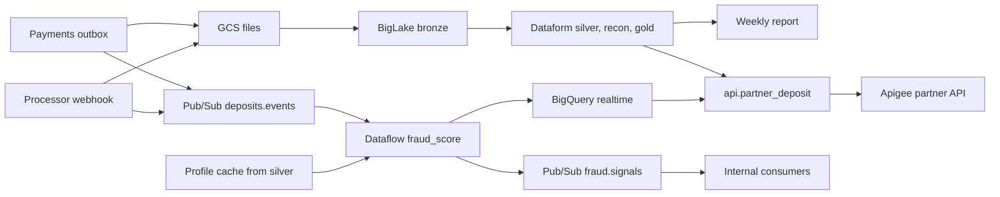

# Part 3 — TL Extension

Stack stays GCS, BigLake, BigQuery, Dataform for the book of record. The new fraud SLO cannot be met inside that graph, so the real-time path is a separate system that never writes silver or gold.

---

## 3a. Unified real-time and batch architecture

**Requirement split.**

| Consumer | Question | SLO | Source of truth |
|---|---|---|---|
| Fraud signal (internal + partner webhook) | Should this deposit be reviewed right now? | Seconds from the payment event | The event itself, plus a stale profile cache |
| C-suite weekly report | What settled, reconciled activity happened? | Weekly, correct | `gold` only, after silver recon |
| Partner read API | What is the agreed state of *my* deposits? | Minutes, stable | A published serving table rebuilt from gold |

A daily vendor CSV cannot fire a signal within seconds. The payments service (and, if offered, the processor webhook) must emit an event at commit time. The file feed stays the batch input. If a processor has no webhook, its deposits are fraud-scored when the file lands, and that gap is explicit.

### Tooling

**Batch, unchanged:** GCS → BigLake → Dataform → silver / recon / gold. Dataform remains the only orchestrator of the warehouse (decision D3 still applies here).

**Stream, new:** Pub/Sub + one Dataflow (Apache Beam) job + BigQuery Storage Write API into a `realtime` dataset.

| Piece | Role |
|---|---|
| Transactional outbox in the payments service | Publishes `deposits.events` in the same transaction as the deposit commit, so a crash cannot lose the event or dual-write a ghost |
| Pub/Sub `deposits.events` | Log of deposit events. Retention ≥ 7 days so the job can be replayed |
| Dataflow `fraud_score` | Stateless rules plus short keyed state (count and sum per `client_id` over a few minutes). Lookup of `risk_category`, `kyc_status`, `account_status` from a cache with a tight timeout |
| Pub/Sub `fraud.signals` | Output. Internal subscribers and the partner webhook sender live here |
| `realtime.deposit_event`, `realtime.fraud_signal` | Append-only audit of what the stream decided. Not an input to gold |
| Profile cache | Refreshed by the existing Dataform run from `silver.client_profile`. The fraud job never queries silver on the hot path |

**Why this and not the alternatives.**

- Dataform, scheduled queries, or a BigQuery MERGE cannot hit a seconds SLO, and a long silver merge must not sit in front of fraud.
- Cloud Run alone is enough for a stateless threshold. It is the wrong place to rebuild windowed velocity, watermarks, and replay. Beam already has those, and the same transforms can be unit-tested in batch mode.
- Kafka and Flink add a second platform. Pub/Sub is the managed bus on the GCP project we already run.
- A pure kappa rebuild (warehouse derived only from the log) would throw away file-based recon, lsn-ordered SCD2, and the weekly snapshot. Those stay on the batch path.

### Coexistence

The paths share a key and nothing else. The stream never MERGEs `silver.client_deposit` and gold never reads `realtime`.

- **No shared schedule.** A stuck Dataflow backlog does not delay the Dataform workflow. A long recon MERGE does not delay the signal.
- **No shared write.** Silver remains the only writer of the deposit book. Stream output is advisory (`fraud_action = ALLOW | REVIEW | HOLD`) plus a later `RETRACT`.
- **Same identity.** Both paths use `(source_system, deposit_id)` so `audit.stream_batch_diff` can compare them. The diff is a Dataform check after the batch load. It does not gate the signal.
- **Replay.** Replaying Pub/Sub is safe: the job keys state by `event_id`, and BQ writes are insert-only on that id. Replaying GCS files stays as already designed (manifest + MERGE + `row_hash`).

### Latency versus consistency

| Decision | Consistency accepted | Why |
|---|---|---|
| Fraud score uses a profile cache that lags silver by one batch run | Eventual, minutes | Risk category and KYC do not change in the fraud window. A cache miss or timeout still emits a score with `enrichment = STALE` |
| Signal transport is at-least-once | Duplicates possible | Consumers dedupe on `event_id`. Exactly-once delivery to a partner webhook is not honest |
| A signal can be wrong once batch recon runs | Correction, not rollback | Emit `RETRACT` with the same `event_id`. Do not wait 3 days of vendor grace to send the first signal |
| Duplicate or late file delivery | Batch wins the book | Newest vendor file date still wins in silver. The stream does not overwrite it |
| Weekly numbers | Strong, as of gold | The report reads `gold` only. Streaming rows are excluded by construction |
| Partner "today" overlay | Labelled provisional | Settled figures come from the last gold publish. Intraday fraud status is a separate field |

Do not accept eventual consistency for the ledger, the weekly report, referential integrity of facts, or PII erasure. `erase_deleted_client_pii` also deletes the short-TTL `realtime` rows and sends the partner a delete notice. Stream tables expire in days; they are an audit of signals, not a second warehouse.

### External API

The partner does not get Pub/Sub, BigQuery, or silver.

- **Gateway.** Apigee (API key is not enough). OAuth2 client-credentials or a signed JWT per partner, mTLS where they support it. Rate limits, request audit logs, no public dataset ACL.
- **Scope.** Row filter on `partner_id`: only deposits that partner processed. Explicit column list: ids, timestamps, amount, currency, status, `fraud_action`, `provisional`. No name, email, or date of birth. Policy tags stay on the warehouse columns; the API never selects them.
- **One published snapshot.** Dataform builds `api.partner_deposit` from gold at the end of a successful run and swaps the view in the same script. Every response includes `as_of_ts` and `schema_version`. That is the consistent view: a finished batch, not a live join across silver and the stream.
- **Provisional field.** `fraud_action` is joined from `realtime.fraud_signal` and returned with `provisional = true` until batch recon has matched that `deposit_id`. Callers who need a stable report pass `as_of` and receive gold only.
- **Webhooks.** Outbound signals are HMAC-signed, retried with the same `signal_id`, and retried as `RETRACT` when batch later rejects the row. Payload schema is versioned; breaking changes are a new version, not a silent field change.
- **Secrets.** Partner credentials and webhook secrets live in Secret Manager. Nothing in the repo or in Dataform vars.

---

## 3b. Build versus buy

A new payment processor must land as a **raw file in GCS** and then follow the existing bronze → silver path. The tool decision is only about extract and land, not about transformation. Transforms stay in Dataform (D2, D4, D6, D9).

### Criteria

1. **Shape of the interface.** File drop (SFTP, S3, GCS) versus cursor API versus webhook. A file drop is almost the pipeline we have.
2. **Who may see the bytes.** Payment and PII data should not transit a SaaS extractor unless legal accepts the subprocessor, the region, and PCI scope. Landing in our bucket avoids that hop.
3. **How much logic is left after extract.** Header aliasing, quarantine, late files, and vendor-priority recon already exist. A platform that loads "clean" BigQuery tables would bypass them.
4. **Count of sources, not elegance.** One processor is a connector. Several processors with different auth and pagination become a platform problem.
5. **Cost versus ownership.** At deposit volume (not clickstream), a managed connector priced per row often costs more than a small puller, and we still own the breaking schema change.
6. **Real-time.** A daily sync product does not satisfy the seconds SLO in 3a. The webhook path is separate either way.
7. **Failure mode.** We must be able to re-drop an immutable object and re-run. The connector's success condition is "object written, generation visible to the manifest," not "rows appeared in a modelled table."

### When each option wins

**Build a thin lander** when all of these hold:

- One source, or a second source with the same file shape.
- Delivery is a file or a simple "list + download" API we can turn into a GCS object under `vendor/<processor>/arrival_date=D/`.
- Compliance wants the bytes only in our project.
- The hard behaviour (idempotency, DQ, recon) is already in Dataform, so the new code is copy, checksum, write, alert on miss.

**Buy Fivetran (extract-only into GCS or a raw dataset)** when any of these hold:

- About three or more new systems in the next two quarters, each with its own OAuth, cursor, and rate limit, and no file export.
- The source is a SaaS database whose CDC Fivetran already maintains, and we would otherwise own that cursor forever.
- Compliance has signed the subprocessor, and connector uptime is worth more than an engineer-week per source per quarter.
- Even then, Fivetran stops at raw landing. Silver mapping and recon stay in this repo. Do not turn on its transformation layer.

**RudderStack** wins for a different job: collecting our own product or device events (session, device fingerprint) into the fraud model. It is a poor fit for a processor settlement file. Do not use it as this connector.

### Recommendation

**Build.** Land the processor as another raw prefix plus a header map and DQ rules in the existing staging view. Add a webhook publisher only if they offer one; that webhook writes `deposits.events` and does not write silver.

Conditions that make build the winner here:

- The warehouse already treats a new file feed as configuration: arrival partition, manifest, alias map, quarantine, MERGE.
- Volume does not justify a second ingestion platform or per-row pricing.
- Payment data should enter through our bucket.
- The weekly report and recon must keep one writer. A bought loader that merges into BigQuery on its own schedule would race Dataform.

**What would change the recommendation.**

- A committed roadmap of three or more non-file sources in two quarters → buy Fivetran as extract-only, still into GCS, still transformed here.
- The processor's only interface is an awkward API that Fivetran already certifies, and legal approves the hop → buy that one connector rather than reverse-engineering pagination.
- We need client-side device context for fraud → add RudderStack (or the app's own events) as a **new** source for the fraud job, not as a replacement for the settlement file.
- They can only produce a daily file and product insists on a seconds-level signal for those deposits → the answer is a webhook or an API we poll every few seconds, not a switch from build to Fivetran. Fivetran does not create an event the processor does not emit.
