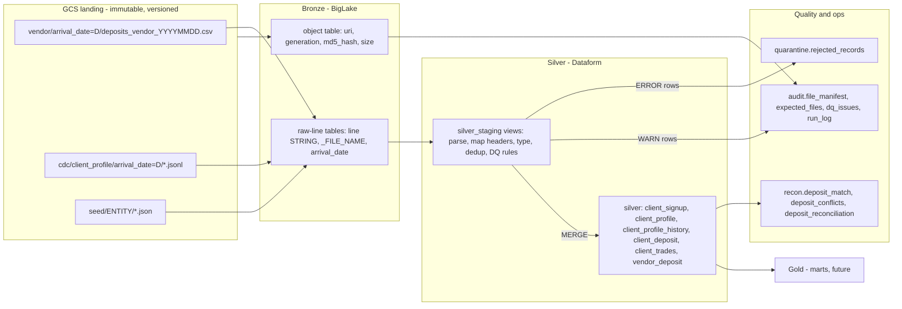

# Pipeline Design - Deriv Trading Data Platform

Part 1a design document. Stack: Google Cloud Storage (GCS), BigLake, BigQuery, Dataform.
All timestamps are UTC. All transformation logic runs in BigQuery; GCS only stores files.

---

## 1. Architecture overview

| Layer | Where | What happens |
|---|---|---|
| Landing | GCS bucket, object versioning + retention policy | Files are written exactly as delivered, under a Hive path keyed by **arrival** date. Nothing is ever modified or deleted. The four warehouse JSON files are placed under `seed/` as the initial state of the target tables. |
| Bronze | BigQuery dataset `bronze` (BigLake tables over GCS) | One raw-line table per feed: a single `line STRING` column plus `_FILE_NAME` and the `arrival_date` Hive partition. Reading every line as an opaque string means a load can never fail on a type error and a column reorder can never shift data silently. A BigLake **object table** exposes each object's `uri`, `generation`, `md5_hash` and `size`. |
| Silver staging | Dataset `silver_staging` (Dataform views) | CSV: header row detected per file, columns mapped **by name** through an alias map, field-count check. JSONL/JSON: `SAFE.PARSE_JSON`. Typing, trimming, case normalization, explicit date parsing, deterministic dedup, and DQ rules producing `error_codes` (ERROR) and `warn_codes` (WARN). |
| Silver core | Dataset `silver` (Dataform incremental tables / MERGE operations) | The four target tables plus `client_profile_history` (SCD2) and `vendor_deposit` (latest vendor view of each deposit). Loaded with MERGE on business keys, partitioned by business date and clustered by `client_id`. |
| Quality / ops | Datasets `quarantine`, `recon`, `audit` | Rejected rows with reasons, reconciliation results and conflicts, file manifest, expected-file calendar, DQ issues, row counts per run. |
| Gold | Future | Marts (client 360, daily deposit/trading KPIs, recon dashboard). |

**Vendor CSV flow.** File lands in `vendor/arrival_date=D/` -> object table / `audit.file_manifest` records it -> `bronze.vendor_deposits_raw` exposes its lines -> `stg_vendor_deposit` maps headers and validates -> valid rows become `silver.vendor_deposit` (one row per vendor deposit, latest file wins) -> `stg_deposit_match` matches them to `silver.client_deposit` -> the apply step writes conflicts, updates/inserts `client_deposit` in one transaction -> `recon.deposit_reconciliation` is recomputed for affected dates.

**CDC flow.** JSONL lands in `cdc/client_profile/arrival_date=D/` -> `bronze.cdc_client_profile_raw` -> `stg_cdc_client_profile` parses and dedups events -> `stg_client_profile_versions` folds the snapshot (version 0, baseline lsn 1000) and all events in **lsn order** into one full row per version -> `silver.client_profile_history` (SCD2) and `silver.client_profile` (current state, soft delete).

**Orchestration.** A Dataform workflow configuration runs the whole graph on a schedule (e.g. hourly). There are no custom services: GCS, BigLake, BigQuery and Dataform only. SLA and data-quality checks are Dataform assertions; failures surface in Dataform run history and Cloud Monitoring alerts.

---

## 2. Idempotency strategy

Re-running any step, any number of times, produces the same warehouse state. Four mechanisms, each covering a different failure:

1. **File manifest keyed on (uri, generation).** `audit.file_manifest` is an incremental table fed from the BigLake object table, with `uniqueKey = [uri, generation]`. A file seen before is not recorded again. A file re-delivered with the same name but different content gets a new GCS generation and a new md5 - it is recorded as a new version and flagged `is_restatement`, and its rows supersede the older version by precedence (below), not by append.
2. **Nothing is appended blindly.** Bronze is a view over the files (no copy, so nothing to duplicate). Every silver table is written with `MERGE` on its business key (`client_id`, `trade_id`, `(source_system, deposit_id)`, vendor `deposit_id`). A `row_hash` (SHA-256 of the business columns) makes unchanged rows a no-op, so `_updated_at` only moves on real change.
3. **Deterministic dedup in staging.** `QUALIFY ROW_NUMBER() OVER (PARTITION BY key ORDER BY vendor_file_date DESC, arrival_date DESC, generation DESC, row_hash)` picks exactly one winner even when the same deposit appears in several files (VDEP002 and VDEP005 appear in both 0301 and 0302).
4. **CDC apply guarded by lsn.** Each profile row stores `last_applied_lsn`. A version is applied only if `version_lsn > last_applied_lsn`. Replaying the whole CDC file, or receiving events out of order, cannot move state backwards. The lsn guard, not a watermark, guarantees correctness; the arrival-date window is only a cost optimization.

Operational logs (`recon.deposit_conflicts`, `quarantine.rejected_records`, `audit.dq_issues`) use deterministic ids (hash of entity + key + rule + source file) and are MERGEd insert-only, so reruns do not duplicate log rows. `audit.run_log` is the only intentional append: one row per step per run.

---

## 3. Late and missing data

**Detection.**
- `audit.expected_files` is a calendar of one expected vendor file per business date (from `vendor_feed_start_date` to `as_of_date`), left-joined to the manifest. Each date is `RECEIVED`, `LATE` (arrived after `business_date + sla_days`), `PENDING` (not yet due) or `MISSING` (overdue, not received).
- An assertion fails when any file is `MISSING`, which alerts on-call. A header-only file counts as received with 0 rows - "empty" is not the same as "missing".

**Self-reconciliation.**
- **Arrival-date partitioning.** Bronze is partitioned by the date a file *arrived*, not the business date inside it. Deposits dated 2024-02-24..28 in the late 0303 file land in a recent arrival partition, so the incremental window (`arrival_date >= as_of_date - 7`) always picks them up. A naive business-date watermark (`deposit_date > max(deposit_date)`) would silently drop all six rows of 0303.
- **Affected dates are recomputed, not appended.** `recon.deposit_reconciliation` deletes and rebuilds the business dates touched by recently arrived vendor rows, plus the last 7 days, in one statement. Because states are derived from current data, they heal on their own:

| State | Meaning | Changes to |
|---|---|---|
| `MATCHED` | Vendor and warehouse agree | - |
| `CORRECTED_FROM_VENDOR` | Warehouse row overwritten with vendor values | - |
| `INSERTED_FROM_VENDOR` | Deposit only existed at the vendor; inserted | - |
| `BLOCKED_*` | Identity conflict, awaiting review | Any of the above once resolved |
| `PENDING` | Internal deposit not yet in any vendor file, within the 3-day grace window | `MATCHED` / `CORRECTED_FROM_VENDOR` when the late file lands, or `MISSING_IN_VENDOR` after grace |
| `MISSING_IN_VENDOR` | Grace expired, still absent | `MATCHED` if the vendor finally delivers |

- **Late-arriving clients.** A vendor deposit whose `client_id` is not in `client_signup` is held as `ORPHAN_PENDING` (not loaded, not rejected) and re-evaluated each run. After the grace window it becomes an ERROR and is quarantined (e.g. VDEP020 for `CL099`).
- **Late restatements cannot roll data back.** Precedence is the vendor file's business date (from the file name), not processing order: if 0302 is processed after a later file, its older values never overwrite newer ones.
- **Outages longer than the lookback** are recovered with a Dataform full refresh; the manifest and MERGE keys make that safe.

---

## 4. Source-delete handling

**Approach: soft delete on the current table + SCD2 history.**

- `silver.client_profile` keeps the row with `is_deleted = TRUE`, `deleted_at` (CDC `commit_ts`) and `deleted_lsn`; the last known attribute values are retained.
- `silver.client_profile_history` holds one row per version (`valid_from`, `valid_to`, `is_current`, `op`, `version_lsn`). The delete is itself a version, closing the previous one.
- Consumers use `silver.client_profile_active` (a view filtering `is_deleted = FALSE`).
- Delete followed by re-insert of the same `client_id` revives the row (`is_deleted = FALSE`) and opens a new history version.

**Why:** CL012 is deleted at lsn 1010 but still owns deposits DEP008 and VDEP004. A hard delete would orphan real money movements; soft delete keeps referential integrity, preserves the audit trail regulators expect, supports point-in-time questions ("what was CL001's risk category on 2024-11-15?") and is reversible.

**Trade-offs.**

| Pro | Con / mitigation |
|---|---|
| Full audit trail and point-in-time queries | More storage (history grows with every change) - negligible at this scale; history is clustered by `client_id`. |
| Deposits/trades keep a valid parent | Consumers querying the base table see deleted clients - mitigated by the `_active` view and column descriptions. |
| Replayable and reversible | Conflicts with GDPR right-to-erasure - mitigated by `erase_deleted_client_pii`, which nulls `full_name`, `date_of_birth` (profile + history) and `email` (signup) for clients deleted longer than `pii_retention_days`, keeping keys and financial facts. |

Rejected alternatives: hard delete (breaks foreign keys, loses history), tombstone-only (no history, cannot answer point-in-time questions).

---

## 5. Edge cases handled

Each case below is present in the sample data.

1. **Vendor schema drift - renamed column (0302).** `payment_method` is delivered as `method`. Bronze keeps raw lines; staging reads each file's own header and maps names through an alias map (`method`, `pay_method` -> `payment_method`). Unknown columns are preserved in `extra_columns`; a file missing a required column is quarantined whole with `FILE_MISSING_REQUIRED_COLUMN`; a row whose field count differs from its header is quarantined with `FIELD_COUNT_MISMATCH` (guards against unquoted commas).
2. **Late, back-dated file (0303).** Every row is dated 2024-02-24..28, earlier than rows already loaded from 0301/0302. Handled by arrival-date partitioning, affected-date recompute and file-date precedence (section 3).
3. **Duplicate delivery across files.** VDEP002 and VDEP005 appear identically in 0301 and 0302. Deterministic dedup + `row_hash` makes the second copy a no-op; if the values had changed, the row is flagged `VENDOR_RESTATEMENT` in `audit.dq_issues` and the newest file wins.
4. **Vendor and warehouse IDs never overlap.** Vendor ids are `VDEP*`, warehouse ids are `DEP*`. Matching is two-pass: exact id (or a previously linked vendor id), then composite (same client + currency, amount within 0.5% / min $0.01, date within 3 days), strictly one-to-one. More than one candidate -> `BLOCKED_AMBIGUOUS_MATCH`. Inserted vendor rows keep their id with `source_system = 'VENDOR'`, so the merge key `(source_system, deposit_id)` can never collide.
5. **CDC out of order, partial images, and inserts on existing keys.** The JSONL is not in lsn order (1005, 1009, 1001, 1004, ...). Applied in file order CL014 would end `risk_category = high` (lsn 1008 after 1009); ordering by lsn gives the correct `medium`. Update events carry only changed columns, so the fold uses key presence: an absent key keeps the prior value, an explicit JSON `null` sets NULL. lsn 1001 inserts CL030, which already exists in the snapshot - treated as an upsert and flagged `CDC_INSERT_ON_EXISTING_KEY`. Each event's `before` image is compared with the folded prior state (`CDC_BEFORE_IMAGE_DRIFT`). lsn gaps (1002, 1007, ...) are expected - lsn is monotonic, not contiguous - so gaps alone never raise alerts.

**Data-quality safeguards (two severities).**

| Severity | Effect | Rules (sample hits) |
|---|---|---|
| ERROR | Row goes to `quarantine.rejected_records` with reason codes; never loaded | Non-positive amount (VDEP001 `-250.00`), missing/unparseable required field (DEP012 has key `credit_card` instead of `payment_method`), unknown status/method, negative fee, non-positive exchange rate, future-dated business date, field-count mismatch, unparseable JSON, conflicting duplicate lsn, orphan client after grace (VDEP020 `CL099`, DEP020 `CL031`) |
| WARN | Row loaded with `dq_flags`, issue logged in `audit.dq_issues` | Activity before `signup_date` (20 of 24 vendor rows; CL007 trade TRD005), KYC not approved (VDEP004 `CL012` rejected, VDEP009 `CL026` pending), implausible date of birth (CL025 `1888-12-19`), PnL inconsistent with prices (TRD012 open = close but PnL 245), trade on inactive account (TRD006), USD with exchange rate != 1, fee greater than amount |

Every step writes row counts read / rejected / warned / loaded to `audit.run_log`.

---

## Appendix - known limitations

- BigQuery external tables have no line-number pseudo-column; within-file order is not preserved. Tie-breaks use deterministic content hashes instead, and exact duplicate lines within one file are collapsed (counted in `run_log`).
- SQL CSV splitting does not support quoted fields containing commas; such rows are caught by the field-count check and quarantined rather than mis-parsed.
- The seed parser requires one JSON object per line (true for the supplied files); a pretty-printed file fails the parity assertion loudly instead of losing rows.
