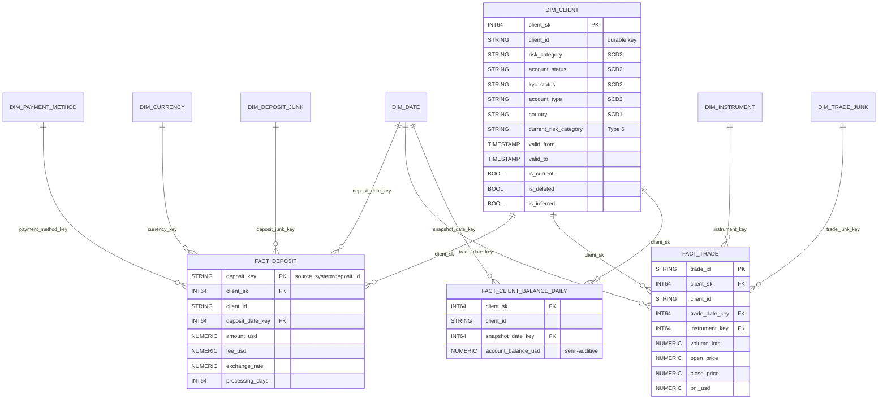

# Part 2 - Data Model & Historization

Gold layer (dataset `gold`) built on top of silver. SQL placeholders: [`sql/gold/`](sql/gold/).

### 2a. Approach: Kimball star schema on top of silver

**Why Kimball, not Data Vault:**
- There are only 3 sources (warehouse tables, the vendor CSVs, the CDC log), with stable business keys (`client_id`, `deposit_id`, `trade_id`).
- The consumers are analytics and regulatory reporting: PnL, deposits, risk exposure by client segment.
- A star gives the simplest, fastest queries on BigQuery.
- Data Vault's strengths (many sources, auditable raw integration, parallel loading) are already covered by our layers:
  - bronze is immutable and replayable;
  - silver keeps the SCD2 history (`client_profile_history`), lineage columns and `recon.deposit_conflicts`.

  A vault would add hubs, links and satellites, plus a second modelling layer, with no new capability.
- **Silver is the integration layer, gold is the star.** If sources multiply later, a vault can be inserted between the two without changing gold.

**Dataset:** `gold`. Surrogate keys are deterministic: `FARM_FINGERPRINT(durable_key || version)`. Reloads therefore reproduce the same keys, and facts never need re-keying. Facts also carry the durable `client_id` (a hybrid key), which allows "as it is now" reporting without a join through history.

**Facts (grain):**

| Fact | Grain | Measures | Notes |
|---|---|---|---|
| `fact_deposit` | One row per deposit (`source_system`, `deposit_id`) | `amount_usd`, `fee_usd`, `exchange_rate`, `processing_days` | Transaction fact, partitioned by `deposit_date`, clustered by `client_id`. `recon_status` and `source_system` go through the junk dimension |
| `fact_trade` | One row per trade (`trade_id`) | `volume_lots`, `open_price`, `close_price`, `pnl_usd` | Transaction fact, partitioned by `trade_date` |
| `fact_client_balance_daily` | One row per client per calendar day | `account_balance_usd` (semi-additive: sum across clients, never across days) | Periodic snapshot built from `client_profile_history` as of end of day (UTC) |
| `fact_deposit_reconciliation_daily` (optional) | One row per recon key per `as_of_date` | count / amount by `recon_status` | Periodic snapshot of `recon.deposit_reconciliation`, for trending breaks over time |

**Dimensions:**
- `dim_client`: SCD2. It merges `client_signup` and `client_profile_history`. PII columns get policy tags.
- `dim_date`: a generated calendar.
- `dim_instrument`: instrument and asset class (FX, metal, crypto, index).
- `dim_payment_method` and `dim_currency`: SCD1.
- `dim_deposit_junk`: every combination of status, source system and recon status.
- `dim_trade_junk`: direction and trade status.

Each dimension has a `-1` "Unknown" member.

**Late-arriving dimension records (inferred members):**
1. When a fact's `client_id` has no row in `dim_client`, an **inferred member** is inserted: `is_inferred = TRUE`, attributes set to 'Unknown', `valid_from = 1900-01-01`. The fact joins to it straight away, so no fact is dropped or held back.
2. When the real client row arrives, the inferred row is **updated in place** (type 1 fill), keeping the same `client_sk`. Later changes create normal SCD2 versions. Facts need no re-keying.
3. **As-of lookup:** a fact's `client_sk` is the version where `valid_from <= event_ts < valid_to`. An event dated before the client's first version falls back to the earliest version and is flagged `dim_lookup_fallback`. This matters here: 20 of the 24 vendor deposits are dated before `signup_date`.
4. Silver already holds unknown-client vendor rows during the grace window (ORPHAN_PENDING). Gold therefore mainly sees late *profile* versions, and inferred members cover the rest.

### 2b. Historization (SCD)

**1. SCD type per attribute:**

| Attribute | Type | Why |
|---|---|---|
| `risk_category`, `account_status` (also `kyc_status`, `account_type`) | **SCD2** in `dim_client` | Regulators ask what the client's risk category was when the trade happened. PnL and exposure must be reportable by the historical segment |
| `current_risk_category`, `current_account_status` | **Type 6** columns (type 1 overwrite on every version) | Lets you report history grouped by the *current* segment without a self-join |
| `account_balance_usd` | **Not a dimension attribute.** Modelled as `fact_client_balance_daily` (periodic snapshot), with full CDC detail kept in `silver.client_profile_history` | The balance is a volatile measure. SCD2 on it would create a new client version on every deposit or trade, exploding `dim_client` and breaking dimension semantics |
| `full_name`, `email`, `country` | SCD1 | Corrections, not business changes. Also subject to PII erasure |

- **Trade-offs:** SCD2 means more rows, joins on date ranges, and care with surrogate keys. In exchange you get correct point-in-time analytics and an audit trail.
- **Mitigations:** clustering on `client_id`, `is_current`, the Type 6 columns, and a `dim_client_current` view.

**2. Update and delete handling:** the logic already exists in silver (`stg_client_profile_versions`) and gold reuses it.
1. Events are ordered by `lsn`, not by `commit_ts` or file order. A version is applied only if its `lsn > last_applied_lsn`.
2. **Update:** partial image with key-presence semantics. The new full state is compared with the current `dim_client` row on the SCD2 columns.
   - If an SCD2 column changed: close the current row (`valid_to = commit_ts`, `is_current = FALSE`), insert a new version, and refresh the Type 6 columns on every version of that client.
   - If only the balance changed: no new dimension version. It goes to the balance fact.
   - Both steps run in one MERGE per client batch.
3. **Delete** (e.g. CL012 at lsn 1010):
   - Close the current version and insert a final version with `is_deleted = TRUE`, `deleted_at = commit_ts`, keeping the last known attributes.
   - Facts (DEP008, VDEP004) keep pointing at valid versions, so referential integrity holds.
   - `dim_client_current` excludes deleted clients. The balance snapshot stops after `deleted_at`.
   - A later re-insert opens a new version.
   - After the retention period, `erase_deleted_client_pii` nulls PII on every version.

**3. Reloading a historical range (e.g. November 2024) without corrupting history:**
1. **Scope by client, not only by date.** Select the clients with events whose `commit_ts` falls in the range. Recompute each one's **full** version chain from the snapshot plus all their events: partial images mean a November version depends on October state, and December versions depend on November.
2. **Deterministic keys:** `client_sk = FARM_FINGERPRINT(client_id || version_lsn)` and the history key is (`client_id`, `version_lsn`). Reprocessing the same bronze files yields the same rows, so a MERGE never creates duplicates.
3. **Atomic replace** in one transaction: delete those clients' versions and insert the recomputed chain. This also removes versions that no longer exist, for example after a corrected CDC file. Other clients are untouched.
4. **Facts:** partition overwrite. For `fact_deposit` and `fact_trade`, rebuild the November `deposit_date` / `trade_date` partitions, re-looking up `client_sk`. For `fact_client_balance_daily`, rebuild from the start of November until the next balance change of each affected client, because the balance carries forward.
5. **Safety:**
   - Take a BigQuery table snapshot (or rely on time travel) before the reload.
   - Parameterize with Dataform vars `reprocess_from` / `reprocess_to`.
   - Dry-run and set `maximum_bytes_billed`.
   - Compare row counts and assertions before and after: one current version per client, no overlapping `valid_from` / `valid_to`.
   - Bronze is immutable and CDC is `lsn`-guarded, so the reload is repeatable.

### SQL files (sql/gold/, placeholders to implement)
- `part2_data_model.md` - Part 2a/2b write-up (from this section).
- `sql/gold/dim_date.sqlx`, `dim_client.sqlx`, `dim_instrument.sqlx`, `dim_payment_method.sqlx`, `dim_currency.sqlx`, `dim_deposit_junk.sqlx`, `dim_trade_junk.sqlx`
- `sql/gold/fact_deposit.sqlx`, `fact_trade.sqlx`, `fact_client_balance_daily.sqlx`, `fact_deposit_reconciliation_daily.sqlx`
- `sql/gold/dim_client_current.sqlx` (view)
- `sql/gold/reprocess_client_history.sqlx` (range reload operation)

