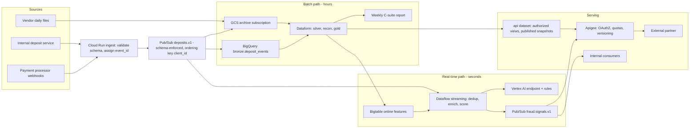

# Part 3 - TL Extension

## 3a. Unified real-time and batch architecture

### Design: one event log, two independent consumers

### Tooling choice and why

| Need | Choice | Why (and the alternative rejected) |
|---|---|---|
| Event backbone | **Pub/Sub** with a schema registry (Avro), 7-day retention, seek/replay | Serverless, autoscaling and native to GCP, with no brokers to run. Kafka/Confluent would win only with a multi-cloud or Kafka-native partner ecosystem, or strict per-partition ordering at very high throughput. |
| Stream processing | **Dataflow (Apache Beam)** | Exactly-once processing, event-time windows and watermarks, stateful velocity counters (deposits per client per 5 min, new payment method, amount vs 30-day average). The same Beam code can backfill in batch. |
| Features / scoring | **Bigtable** (online features, single-digit ms reads) + **Vertex AI endpoint** + a rules layer | Historical features (risk category, KYC status, lifetime deposits) are computed in batch from gold and pushed to Bigtable. Real-time counters live in Dataflow state. Rules give an explainable baseline and keep working if the model is unavailable. |
| Batch | Existing **GCS -> BigLake -> BigQuery -> Dataform** medallion | Unchanged. Deposit events join it as another bronze source via a Pub/Sub BigQuery subscription and a Cloud Storage subscription (immutable archive). |
| External serving | **Apigee** in front of **authorized views / Analytics Hub** (batch data) and a **webhook push** of fraud signals | Partners never touch warehouse tables or Pub/Sub directly. |

Target: signal emitted with p99 under 2 seconds from the deposit event. Each event gets a deterministic `event_id`, so duplicates from at-least-once delivery are dropped in Dataflow (keyed state) and in BigQuery (MERGE on `event_id`).

### How the paths coexist without blocking each other
- **Separate subscriptions.** Each consumer has its own subscription, with its own acknowledgements, backlog and retry/dead-letter topic. A stalled batch load never holds back fraud scoring, and vice versa.
- **Separate compute.** Dataflow runs on its own workers. BigQuery uses **separate reservations**: `batch` for Dataform and the weekly report, `interactive/api` for partner and internal queries. Batch jobs are capped, so a heavy weekly report cannot starve API queries.
- **One source of truth, one direction of flow.** The event log feeds both paths. The only coupling is batch to real-time through the feature push (Bigtable), which is asynchronous. If the push is late, fraud scoring uses slightly stale historical features and keeps running.
- **Replay without collision.** Batch backfills read the GCS archive; streaming replays use Pub/Sub seek to a timestamp. Both are idempotent through `event_id`.
- **Shared contract.** Event schemas are versioned (`deposits.v1`). Breaking changes create a new topic version, so both paths migrate independently.

### Latency vs consistency

| Consumer | Consistency model | Accept eventual? |
|---|---|---|
| Fraud signal | Scores the *provisional* event within seconds, before vendor reconciliation, with features up to about a day stale | **Yes.** Speed matters more than completeness. The signal triggers a hold and review, not an irreversible action, so a false positive is recoverable. |
| Internal ops dashboards, partner "recent activity" endpoint | Near-real-time, every response carries an `as_of` watermark | **Yes**, as long as staleness is visible to the consumer. |
| Weekly C-suite report, balances, regulatory numbers | **Strong**: built from reconciled data for a *closed* period. The week is frozen at a cutoff (e.g. Monday 06:00 UTC, after grace). Data arriving after the cutoff is posted as a documented restatement next week, never silently changing a published number. | **No** |
| Reconciliation / ledger | Strong: vendor-priority rules, conflicts log | **No** |

Rule of thumb: eventual consistency is acceptable for *detection and observation*, never for *financial statements or money movement decisions without human review*.

### Consistent, secure view for the external API
- **Consistency: write-audit-publish.** Dataform builds the next version of the partner data product in a staging table and runs its assertions. Only then does it atomically swap the published version (a new snapshot table plus a view repoint). Partners never see a half-loaded batch. Every response includes `snapshot_id` and `as_of`, so paginated reads stay on one snapshot.
- **Contract:** versioned API (`/v1/deposits`) backed by versioned views in a dedicated `api` dataset. Internal schema changes never leak through; deprecations get notice periods.
- **Authentication:** OAuth2 client credentials or mTLS through Apigee, with per-partner API keys, quotas, rate limits and spike arrest.
- **Authorization:** row-level security (a partner sees only its own clients and transactions), column-level policy tags, and dynamic masking for PII (`email`, `full_name`, `date_of_birth`).
- **Perimeter:** VPC Service Controls around BigQuery, GCS and Pub/Sub; CMEK encryption; no public datasets.
- **Audit:** Cloud Audit Logs plus Apigee analytics per partner, with alerts on unusual access patterns.
- **Real-time partner feed:** fraud or status events are pushed via signed webhooks (HMAC) from Apigee, with retries and a replay endpoint keyed by `event_id`.

---

## 3b. Build vs buy (new payment processor)

### Decision criteria

| Criterion | Question |
|---|---|
| Connector fit | Does a **certified, maintained** connector exist for this processor, covering the objects we need (transactions, settlements, refunds, chargebacks)? |
| Freshness | Is batch sync (5-60 min) enough, or do we need webhooks within seconds (the fraud path)? |
| Semantics and correctness | Can we control idempotency keys, restatements, late files and field-level lineage for reconciliation? |
| Volume and cost | Integration platforms price by monthly active rows (MAR). Payment events are high-volume, so compare platform fees against engineering cost (build plus about 0.2-0.5 FTE per year of maintenance). |
| Compliance | Would card or PII data transit a third party (PCI DSS scope, DPA, data residency, SOC 2)? |
| Strategic value | Is this core to the business (payments for a trading platform: yes) or long-tail (CRM, marketing)? |
| Team and time | Deadline, team capacity, on-call burden. |
| Exit cost | How locked in would we be, and can we migrate behind a stable bronze contract? |

### When each option wins

**Buy (Fivetran / RudderStack) wins when:**
- a certified connector exists and covers the required objects;
- batch freshness is acceptable;
- volume is moderate, so the cost stays below the engineering cost;
- the data is not in PCI scope, or the vendor is certified for it;
- the deadline is tight and the team is small;
- the source is non-core or long-tail.

**Build wins when:**
- there is no connector, or it is immature (missing chargebacks or settlement files);
- real-time webhooks are required;
- high volume makes row-based pricing expensive;
- the delivery is complex (SFTP settlement files, restatements, back-dated records, as with our vendor CSVs);
- strict compliance rules apply;
- it is a core domain where correctness and reconciliation control matter;
- we already have a reusable ingestion framework, so the marginal cost is low.

### Recommendation for this case: build a thin connector on our existing framework

- **Why build:**
  - A payment processor feeds both **real-time fraud** (needs webhooks within seconds, which sync platforms do not provide) and **financial reconciliation** (needs control over idempotency, late and restated records, and file lineage).
  - We already have the pattern: GCS landing, manifest, raw-line bronze, alias map, data-quality severity, vendor-priority reconciliation. Onboarding a processor is mostly configuration (header aliases, required columns, match rules) plus one webhook receiver.
  - Payments are core. Keeping PCI-adjacent data inside our perimeter avoids widening compliance scope.
- **What gets built:**
  - Webhook receiver (Cloud Run, signature verification) -> `payments.<processor>.v1` Pub/Sub topic, which feeds the real-time path.
  - Daily settlement file or API pull (Cloud Run job) -> GCS landing, which feeds the batch reconciliation path.
  - Contract tests against the processor's sandbox, schema-drift alerts, and freshness SLAs through `audit.expected_files`.
- **Buy for the long tail:** keep Fivetran or RudderStack for non-core SaaS sources, landing into the same bronze contract so either side can be swapped later.

### What would change my mind
- The processor has a **certified connector with near-real-time support** (or native BigQuery delivery), is PCI-compliant under our DPA, and the fraud path can use the processor's own webhooks. Then buy for batch and build only the webhook receiver.
- **Volume is low** and the platform cost is clearly below the maintenance cost of about 0.3 FTE.
- The **deadline is weeks away** and the team is at capacity. Then buy now behind the stable bronze contract and plan to build later.
- The processor's API is complex and changes frequently, so a vendor absorbing that maintenance is worth the fee.
